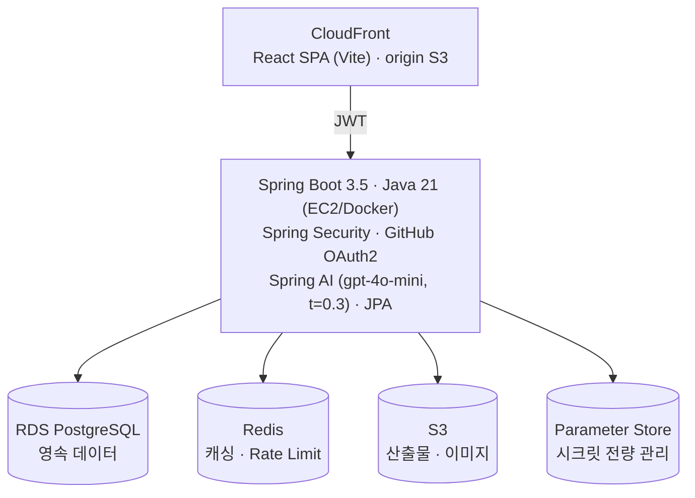
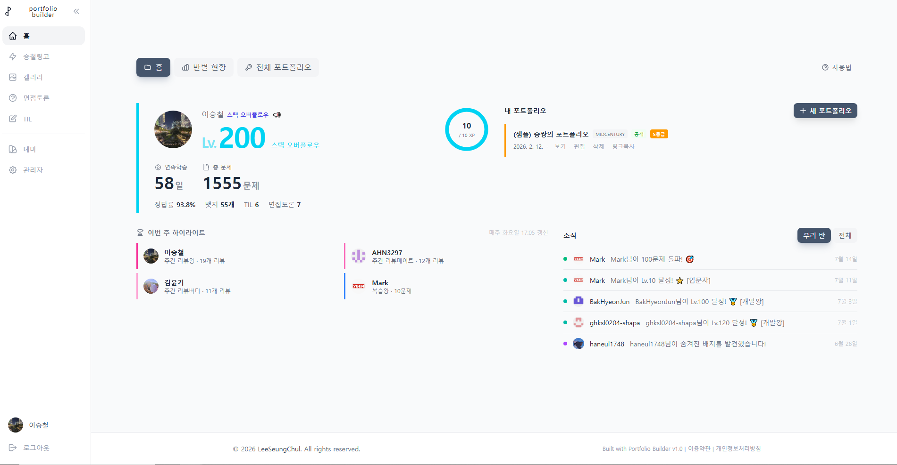
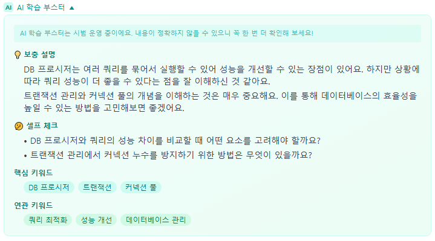
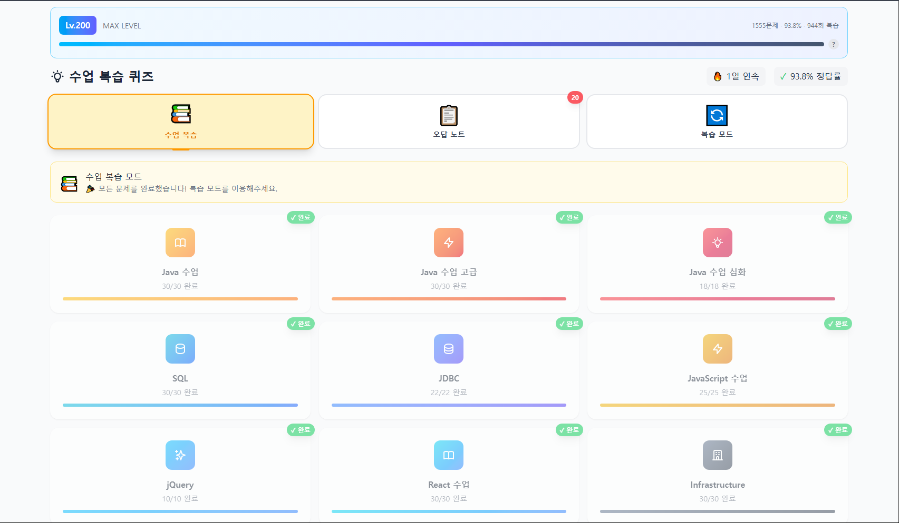

<div align="center">

# Portfolio Builder

6개월 개발자 양성과정에서 교육생이 포트폴리오를 끝까지 완성하도록 만든 도구입니다.
GitHub 커밋을 자동으로 끌어와 초안을 구성하고, 규칙·활동·LLM 3중 채점으로
기준점을 넘긴 경우에만 강사 피드백을 요청할 수 있게 설계했습니다.

강사 검토 1인당 40분 → 10분 · 프로그램 저작권 등록 (C-2026-029550)

## 아키텍처

| 영역 | 구성 |
|---|---|
| Frontend | S3 + CloudFront |
| Backend | Spring Boot 3.5 (Java 21) |
| Database | Amazon RDS |
| Storage | S3 |
| AI | Spring AI (temperature 0.3) |
| Secrets | AWS Systems Manager Parameter Store |
| Monitoring | Grafana Cloud, Google Analytics |
| CI/CD | GitHub Actions |

### 초기 구조에서 바꾼 것

| | 이전 | 현재 |
|---|---|---|
| 프론트 배포 | 서버 직접 서빙 | S3 + CloudFront |
| DB | 강의실 로컬 Oracle | RDS PostgreSQL |
| 시크릿 | 설정 파일 직접 기재 | Parameter Store |
| 관측 | 없음 | Grafana Cloud · Google Analytics |

만들어놓고 잘 돌고 있겠거니 두면 안 된다고 봐서 관측을 먼저 붙였습니다.
기능별 참여율은 관리자 화면에서, 서버 상태와 유입은 Grafana와 GA에서 봅니다.

세 항목의 기준점을 넘겨야 강사 피드백을 요청할 수 있습니다.
평가 도구라 출력이 매번 달라지면 곤란해서 temperature는 0.3으로 고정했습니다.


<br>


<br>

**2026.01 배포 · 운영 중 · 누적 사용자 59명 · 프로그램 저작권 등록 (2026.06)**
개인 프로젝트 · 기획–개발–배포–운영 단독 수행 · 운영비 자비 부담 (월 약 8만원)

[**데모**](https://kh-jongno.shop/) · [**스크린샷**](#screenshots) · [**아키텍처**](#3-아키텍처)

</div>

---

## 1. 배경

IT 교육과정에서 교육생 30명의 포트폴리오를 강사 1인이 전수 검토하는 구조에서, 세 가지 문제가 관찰되었다.

### 1.1 품질 편차

동일 과정 수료생 간 산출물 완성도의 차이가 크다.

상위 교육생은 자력으로 기준을 충족하나, **하위 교육생은 무엇이 부족한지 인지하지 못한다.**

### 1.2 산출물의 획일성

기관이 제공하는 연계기업 제출용 템플릿은 양식 통일을 목적으로 한다.

그러나 **모든 교육생이 동일 템플릿을 채우는 방식은 결과적으로 변별력을 제거한다.**

> 통일을 위한 템플릿이, 차별화를 불가능하게 만든다.

### 1.3 피드백 기준의 비일관성 — 핵심 문제

**단일 검토자가 30건을 순차 검토할 때, 피드백 기준은 일정하게 유지되지 않는다.**

| 요인 | 결과 |
| :--- | :--- |
| 검토 순번 (1번 vs 25번) | 집중도 저하 |
| 검토 시점 (오전 vs 심야) | 판단 기준 이동 |
| 누적 피로 | 지적 밀도의 편차 |

동일 수준의 산출물이 검토 조건에 따라 **다른 피드백을 받는다.**
이는 처리량의 문제가 아니라 **평가 신뢰도의 문제다.**

<br>

> ### 요구사항
> 강사를 대체하는 시스템이 아니라,
> **강사 앞단에서 모든 산출물에 동일 기준을 적용하는 1차 검증 계층.**

---

## 2. 해결

| 문제 | 접근 | 효과 |
| :--- | :--- | :--- |
| **피드백 비일관성** (1.3) | **LLM 1차 검증 계층** | 검토 조건과 무관하게 동일 기준 적용 |
| **품질 편차** (1.1) | 위 계층이 최소 기준 보장 | 하한선 상향 |
| **산출물 획일성** (1.2) | **GitHub 저장소 연동** | 템플릿이 아닌 **개별 코드베이스**에서 구성 |

<div align="center">

**1차 · LLM — 일관성**  |  **2차 · 강사 — 개별 맥락 및 심화**

LLM은 강사를 대체하지 않고, 강사의 편차 구간을 흡수한다.

</div>

<br>

### 2.1 GitHub 연동

OAuth를 통해 교육생의 실제 저장소를 조회하고, 커밋·언어·구조 정보를 기반으로 포트폴리오를 구성한다.

양식 입력이 아닌 **코드 기반 생성**이므로 산출물이 개별화된다.

### 2.2 LLM 1차 피드백

`gpt-4o-mini` 기반. 강사의 역할이 **피드백 생산에서 검수·심화로 이동**한다.

**강사 소요시간: 1인당 40분 → 10분**
단축 자체보다, **확보된 시간을 개별 맥락 대응에 재배분**한 것이 설계 목적이다.

### 2.3 프롬프트 설계

교육생은 미완성 산출물의 대면 제출을 회피하는 경향을 보인다. 지적 경험에 대한 부담 때문이다.

이에 피드백 프롬프트를 **비판단적(non-judgmental) 톤**으로 설계했다.
**제출 부담이 낮을수록 제출 빈도가 증가하며**, 

완성 후 1회 제출보다 미완성 상태의 반복 제출이 학습 효율에서 유리하다.

### 2.4 부가 기능

| 기능 | 목적 |
| :--- | :--- |
| 이해도 진단 (O/X · 4지선다) | 학습 상태 상시 측정 |
| TIL (Today I Learned) | 학습 기록 축적 → 포트폴리오 원자료 |
| 면접 질문 생성 | 포트폴리오 기반 예상 질의 도출 |
| 포트폴리오 공유 | 교육생 간 상호 참조 |

---

## 3. 아키텍처



<sub>*프론트엔드 저장소는 교육생 개인정보 및 운영 설정을 포함하여 비공개로 관리한다.</sub>

---

## 4. 설계 결정과 근거

**개인 프로젝트이며 운영비를 자비로 부담한다 (월 약 8만원).
비용 제약이 다음 결정들을 규정했다.**

| 결정 | 근거 |
| :--- | :--- |
| **`temperature: 0.3`** | 1차 검증 계층의 존재 이유는 **기준의 일관성**이다. 응답이 매 호출마다 흔들리면 인간 검토자와 동일한 문제가 재발한다. 창의성보다 재현성을 우선. |
| **`gpt-4o-mini`** | 다수 사용자의 반복 호출 구조에서 상위 모델은 비용상 지속 불가능. |
| **Rate Limiting (일 3회)** | 오타 수정·이미지 첨부 후 재요청하는 사용 패턴을 **사전 예측**하여 설계 단계에서 적용. **사후 대응이 아님.** |
| **Redis 캐싱** | 중복 요청 및 조회성 데이터 대응.<br><sub>산출물이 개별적이므로 캐시 히트율은 제한적.</sub> |
| **Spring AI** | 별도 Python 추론 서비스를 두지 않고 기존 Spring 스택에 통합. 단일 런타임으로 운영 복잡도 억제. |

> Rate Limit은 비용 초과 이후 도입된 것이 아니라, **최초 설계에 포함된 제약**이다.

---

## 5. 운영 결과 및 한계

### 5.1 기능별 참여율의 분화

| 유형 | 기능 | 참여 | 특성 |
| :--- | :--- | :---: | :--- |
| **필요 기반** | 포트폴리오 작성 | **높음** | 즉시 효용 · 미이행 손실 명확 · 1회성 |
| **습관 기반** | TIL · 퀴즈 · 면접 준비 | **낮음** | 지연 효용 · 미이행 손실 불명확 · 반복적 |

핵심 기능은 목표를 달성했으나, **일일 접속을 요구하는 기능군은 정착에 실패했다.**

### 5.2 원인 — 설계 오류

초기에는 학습자의 태도 문제로 진단했으나, 재분석 결과 설계 단계의 오류였다.

<div align="center">

**포트폴리오는 학습자의 필요에서 출발한 기능이고,
TIL과 퀴즈는 교육자의 필요에서 출발한 기능이다.**

</div>

이해도 상시 파악과 학습 기록 축적은 **나의 요구사항**이었다.

학습자에게는 즉각적 효용이 없었으며, 도구의 존재만으로 습관이 형성되지 않았다.

**심리적 장벽 제거(비대면·비판단)에는 성공했으나, 참여 동기 설계에는 실패했다.**

*장애물 제거*와 *유인 설계*는 별개의 과제이며, 본 구현은 전자에만 대응했다.

### 5.3 개선 방향

- **종속 구조화** — TIL 축적이 포트폴리오 생성의 선행 조건이 되도록 연결
- **즉시 효용 부여** — 진단 결과가 학습자에게 즉각적 가치를 반환하도록 재설계
- **절차 편입** — 과정 필수 제출 항목과 연동

---

## 6. 알려진 한계

| 항목 | 내용 | 상태 |
| :--- | :--- | :--- |
| **OAuth 스코프** | 초기 구현이 `repo` 스코프를 요청. 대상이 공개 저장소이므로 `public_repo`로 충분하며, **최소 권한 원칙 위반**에 해당 | 축소 적용 |
| **습관 기능 참여율** | [5장](#5-운영-결과-및-한계) 참조 | 재설계 중 |
| **캐시 효율** | 산출물의 개별성으로 히트율 저조 | 개선 여지 |
| **테스트 커버리지** | 부족 | 보완 예정 |

---

## Screenshots

<div align="center">

| 포트폴리오 빌더 | AI 피드백 | 이해도 진단 |
| :---: | :---: | :---: |
|  |  |  |

</div>

---

## API

| Method | Endpoint | 설명 |
| :--- | :--- | :--- |
| `GET` | `/health` | 헬스체크 |
| `GET` | `/api/auth/github/login` | GitHub 로그인 URL |
| `GET` | `/api/auth/github/callback` | OAuth 콜백 |
| `GET` | `/api/portfolios` | 포트폴리오 목록 |
| `POST` | `/api/portfolios` | 포트폴리오 생성 |
| `GET` | `/api/public/portfolios` | 공개 포트폴리오 |

---

## 기술 스택

| 영역 | 스택 |
| :--- | :--- |
| **Backend** | Java 21 · Spring Boot 3.5 · Spring Security · Spring AI · Spring Data JPA |
| **AI** | OpenAI `gpt-4o-mini` · `temperature 0.3` |
| **Database** | Oracle 18c |
| **Cache / Rate Limit** | Redis |
| **Storage** | AWS S3 |
| **Infra** | AWS EC2 · Docker · GitHub Actions |
| **Frontend** | React (Vite) — *별도 저장소, 비공개* |

---

## 로컬 실행


## 설정

DB 접속 정보, GitHub OAuth, JWT 시크릿, OpenAI 키 등 모든 민감 정보는
AWS Systems Manager Parameter Store에서 조회합니다. 저장소에는 값이 없습니다.

| 파라미터 | 용도 |
|---|---|
| `/portfolio/db/*` | RDS 접속 정보 |
| `/portfolio/github/*` | OAuth client id · secret |
| `/portfolio/jwt/secret` | 토큰 서명 키 |
| `/portfolio/openai/api-key` | Spring AI 호출 |

S3 접근은 IAM Role로 처리하며 액세스 키를 코드나 설정에 두지 않습니다.

## 실행

AWS 자격증명이 설정된 환경에서 실행합니다.

```bash
./gradlew bootRun
```

## 배포

```bash
./gradlew bootJar
java -jar build/libs/portfolio-api-0.0.1-SNAPSHOT.jar --spring.profiles.active=prod
```

GitHub Actions로 빌드 후 배포합니다.

</details>

---

<div align="center">

**License** · MIT

<sub>프로그램 저작권 등록 — 한국저작권위원회, 2026.05</sub>

</div>
